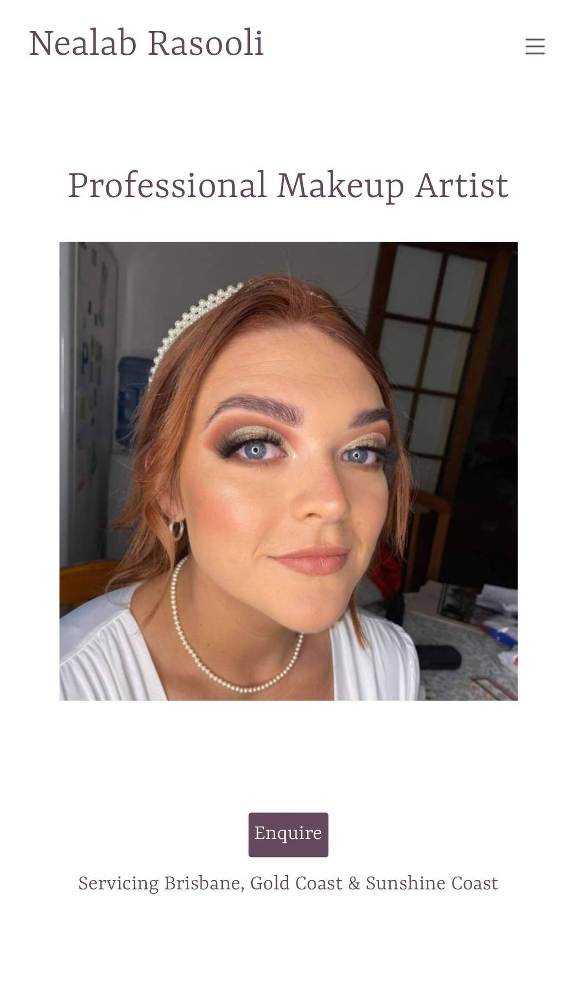
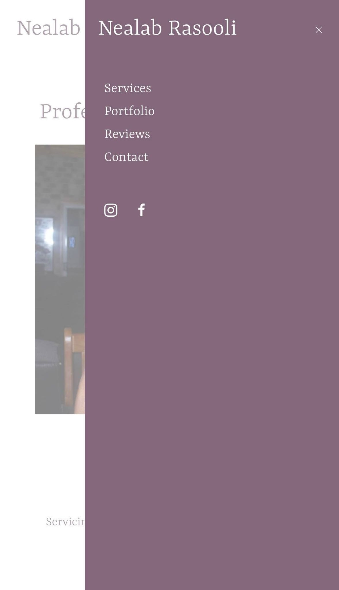

# Nealab Makeup (LIVE)
https://nealabmakeup.com  
https://nealabmakeup.com/admin  
 

## Personal Project
Responsive Web application (Mobile/Desktop Views)  
Built using React  
Firebase used for Authentication & Storage  
Confirmation Emails sent to user/nealab using email js.  

## Backend portal
Admins are able to see all booking enquiries made using https://nealabmakeup.com/admin login portal.    
Admins are able to upload new photos for the portfolio/photo slider.   
Admins are able to add/remove/edit services.  
Admins are able to add/remove new reviews.  

## Inital Designs
https://www.figma.com/file/vP682iDQGvBNhJVDK22Keb/Nealab-Rasooli---Makeup?node-id=0%3A1 

## Responsive
  
  